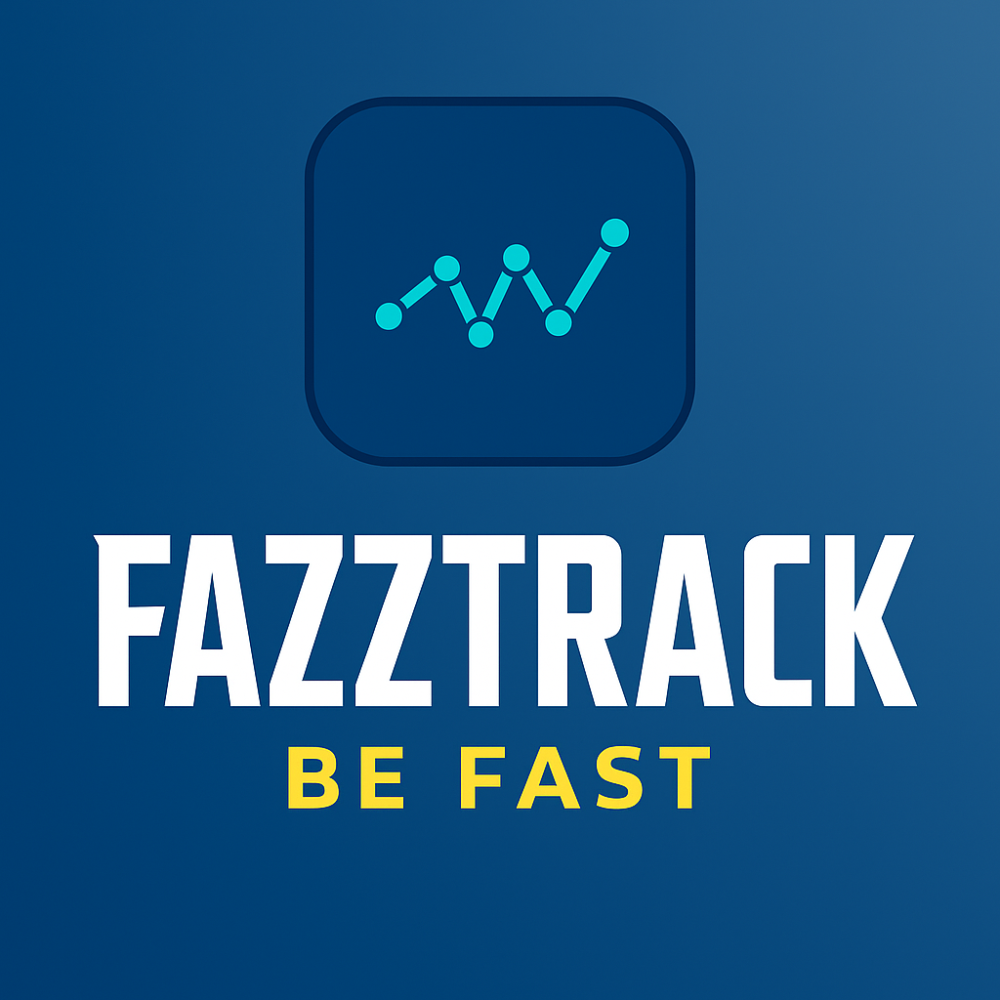

# FazzTrack - Student Bar Management System



FazzTrack is a comprehensive solution for staff managing consumption and payments in a student bar environment. The system consists of a Flutter mobile application for staff members and a NestJS backend for administration and data processing.

## Project Overview

FazzTrack helps staff at educational institutions manage student consumption in campus bars and cafeterias by:

- Tracking student purchases and account balances
- Managing inventory and stock levels
- Generating consumption reports for administrators
- Sending weekly consumption reports to parents/guardians via email or PDF
- Providing an intuitive interface for staff members

## System Architecture

The project is structured into two main components:

### FazzTrack App (Flutter)

- Staff-only mobile application for managing student bar operations
- Processing student transactions
- Inventory and stock management
- Student account balance tracking
- Report generation for administrators and parents/guardians

### FazzTrack Backend (NestJS)

- RESTful API endpoints for the mobile application
- Administrative dashboard
- Authentication and authorization
- Report generation system
- Email notification service to parents
- Data analytics and processing

## Deployment

The system is designed to be deployed using Docker containers, with databases hosted in the cloud:

```plaintext
Docker Architecture:
├── fazztrack_app (Flutter container)
├── fazztrack_backend (NestJS container)
└── Database (Cloud-hosted)
```

## Features

### For Staff

- Student transaction processing
- Inventory management
- Sales tracking
- Student account management
- Financial reporting
- Parent/guardian notification management

### For Administrators

- System configuration
- User management
- Financial oversight
- Consumption analytics

### Communication Features

- Automated weekly reports to parents/guardians
- Balance alerts
- Consumption summaries
- PDF report generation

## Getting Started

### Prerequisites

- Docker and Docker Compose
- Node.js (for development)
- Flutter SDK (for development)
- Access to cloud database services

### Installation

1. Clone the repository
2. Configure environment variables
3. Build and run the Docker containers

Detailed setup instructions can be found in the individual READMEs of each component:

- [FazzTrack App Setup](./fazztrack_app/README.md)
- [FazzTrack Backend Setup](./fazztrack_backend/README.md)

## Reporting

The system generates several types of reports:

- Stock levels and inventory
- Daily/weekly/monthly consumption patterns
- Financial summaries
- Student-specific consumption reports for parents

## Contact

For inquiries about using or contributing to this project, please contact:

🧑🏽‍💻Alex Cordova Balon. - [acordov_](https://github.com/acordovb)
Mail: [alexcordova111@gmail.com](mailto:alexcordova111@gmail.com)

## License

This project is licensed under the MIT License - see the LICENSE file for details.

© 2025 FazzTrack. All rights reserved.
